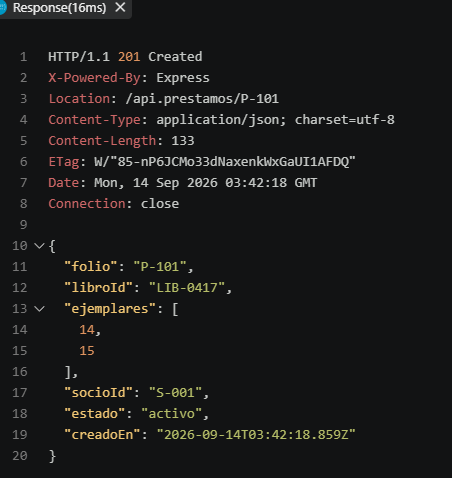
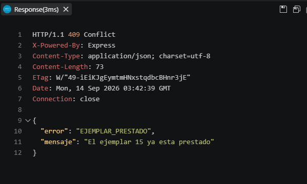
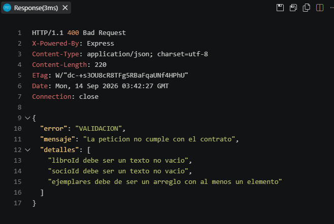

Práctica 04 

1\. Express manda los rechazos de un handler async directo al middleware de errors, sin try/catch en cada ruta. ¿Qué tendrían que agregar en cada ruta si esto no fuera así?

Tendria que envolver el cuerpo de cada handler en un try/catch y en el catch llamar a 'next(err)' para pasarle el error al middleware de errores.

2\. ¿Por qué el servicio no lanza directamente un 409 en vez de EjemplarPrestadoError?

Porque el servicio es la capa de dominio y el dominio no debe de conocer la existencia de HTTP. 409 es un concepto de HTTP, entonces el que el servicio lo conozca generaria un acoplamiento entre eso y la forma que alguien decide exponerlo. En este caso es preferable que el dominio lance un error con significado propio y asi la misma regla de negocio se puede reutilizar en cualquier lado.

3\. Si mañana agregaran una app móvil que también consume esta API, ¿qué archivos de esta práctica tendrían que tocar?

Ninguno del backend. Solo seria otro cliente HTTP mas, igual que el cliente.ts que hemos estado utilizando, utilizaria los mismos endpoints y el mismo contrato JSON. Esto es gracias a que la API esta desacoplada del cliente web, asi que agregar un consumidor nuevo no significa cambiar rutas, ni servicios, ni DTOs, todo se manda igual, solo se conecta un nuevo cliente sin tocar el servidor.

