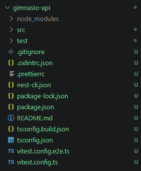
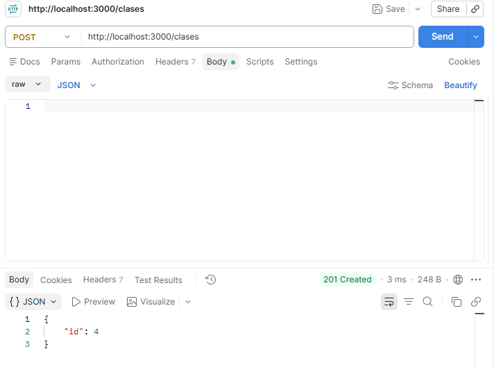
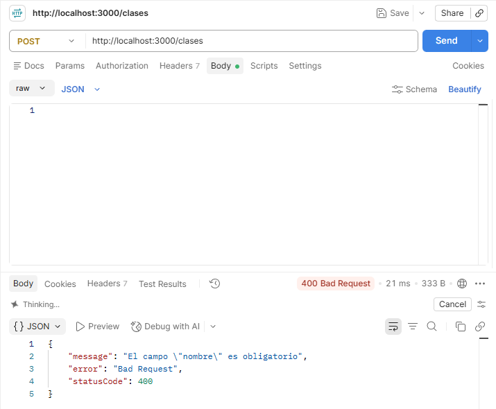
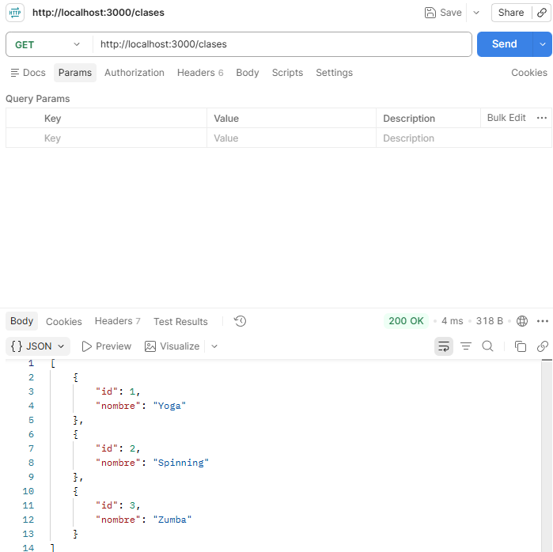

# Práctica 05: Primera API con NestJS

API mínima que expone el catálogo de clases de un gimnasio. Los datos se
guardan en un arreglo en memoria, por lo que se pierden al reiniciar el servidor.

## Cómo ejecutarla

```bash
npm install
npm run start:dev
```

## Respuestas

### 1. ¿Qué generó el comando `nest new`?
Generó un proyecto completo y ejecutable: `package.json` con dependencias y
scripts (`start:dev`, `build`, `test`), configuración de TypeScript
(`tsconfig.json`), configuración de lint y formato, la carpeta `src/` con un
módulo (`app.module.ts`), un controlador (`app.controller.ts`), un servicio
(`app.service.ts`) y el punto de entrada (`main.ts`), la carpeta `test/` para
pruebas e2e, las dependencias instaladas en `node_modules` y un repositorio git
inicializado.



### 2. ¿Qué hace el AppService que ya viene generado?
Contiene la lógica del ejemplo: el método `getHello()` devuelve el texto
`'Hello World!'`. Está decorado con `@Injectable()`, por lo que Nest lo inyecta
en el constructor de `AppController`, que lo llama desde la ruta raíz.
La línea que arranca la aplicación en `main.ts` es `await app.listen(...)`,
después de crear la app con `NestFactory.create(AppModule)`.

### 3. ¿Por qué la ruta funciona sin declarar nada en `app.module.ts`?
Porque `AppController` ya está registrado en el arreglo `controllers` de
`AppModule`. Nest lee los decoradores (`@Controller`, `@Get`) de ese
controlador y registra todas sus rutas automáticamente, así que agregar un
método nuevo dentro de un controlador ya registrado no requiere modificar el
módulo. Solo se edita `app.module.ts` cuando se añade un controlador o
proveedor nuevo.

### 4. ¿Qué pasaría si el cuerpo de la petición viniera vacío?
Sin validación, `cuerpo.nombre` sería `undefined` y se guardaría una clase sin
nombre (`{ id: 3 }`) con respuesta 201; si el cuerpo llegara como `undefined`
(por ejemplo, sin el header `Content-Type: application/json`), se lanzaría un
`TypeError` y la respuesta sería 500. Por eso el método valida el campo y
responde **400 Bad Request** con el mensaje `El campo "nombre" es obligatorio`.






### 5. ¿En qué archivo vive hoy toda la lógica de la práctica?
En `src/app.controller.ts`: ahí están la interfaz `Clase`, el arreglo de datos
y las rutas GET y POST. Funciona para una práctica, pero mezcla
responsabilidades; lo recomendable sería mover el arreglo y la lógica de
listar/crear a un servicio y dejar al controlador solo la recepción de
peticiones.

## Capturas

### Listado inicial `GET /clases`

