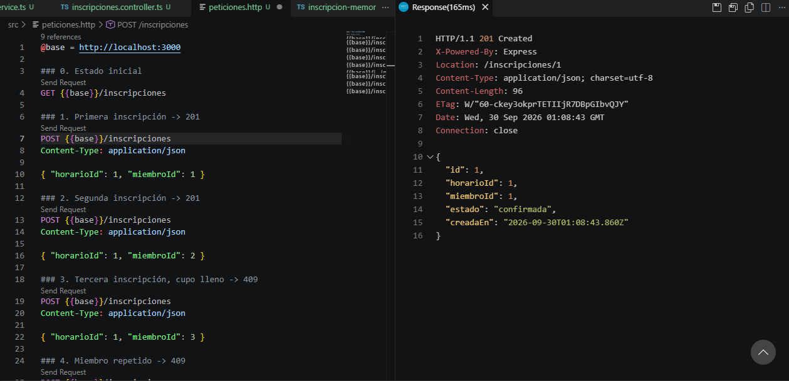
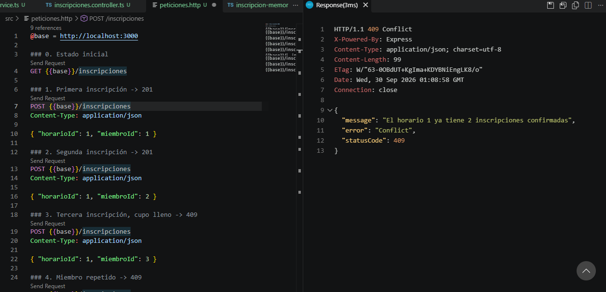
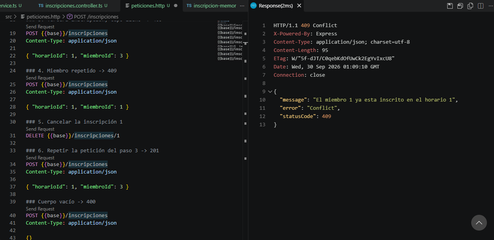
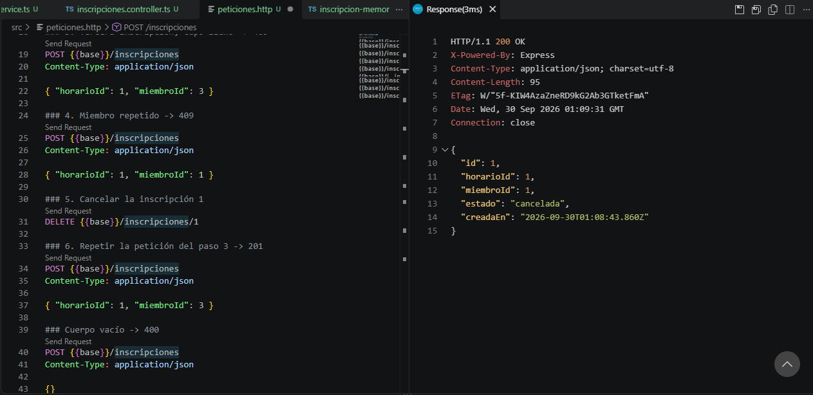
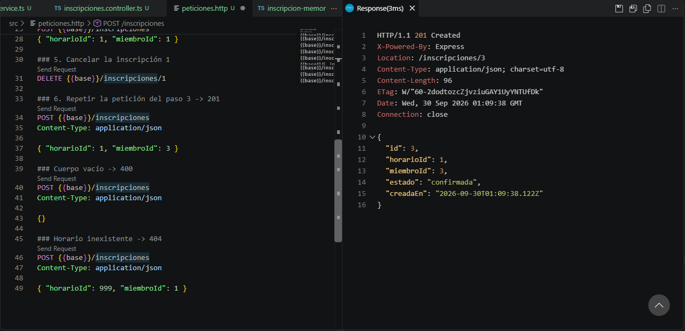

# Práctica 06: Conectar el dominio con la API

API de NestJS separada en Controller, Service y Module. Conecta el dominio de
inscripciones del gimnasio mediante inyección de dependencias con token y
traduce los errores de negocio a códigos HTTP.

## Cómo ejecutarla

```bash
npm install
npm run start:dev
```

## Respuestas

### 1. ¿Qué pasaría si el módulo no quedara registrado en la raíz?
Nest construye el grafo de dependencias partiendo de `AppModule`. Un módulo que
no esté en los `imports` de la raíz (directa o indirectamente) nunca se carga:
sus controladores no registran rutas y sus servicios no se instancian. No hay
error de compilación; simplemente las rutas responden 404. El generador
(`nest g module`) lo registra solo, pero si se crean los archivos a mano hay que
agregarlo.

### 2. ¿Por qué los métodos del repositorio devuelven promesas si los datos van a estar en memoria?
Porque la interfaz es un contrato para cualquier almacenamiento, y una base de
datos real es asíncrona. Si la interfaz fuera síncrona, cambiar a una base de 
datos obligaría a modificar el servicio y todo el código que la usa. Con promesas 
desde ahora, solo cambia la implementación.

### 3. ¿Qué error apareció al cambiar a la interfaz, y por qué la clase sí se había resuelto sola?
Las interfaces de TypeScript desaparecen al compilar, así que Nest solo ve
`Object` y no tiene una llave con qué buscar el proveedor. Una clase sí existe
en tiempo de ejecución, por lo que sirve como su propia llave y Nest la resuelve
solo.

### 4. ¿Por qué el servicio necesita un token para el repositorio, pero el controlador no lo necesita para el servicio?
El servicio es una clase: existe en ejecución y es su propio token. El
repositorio se declara con una interfaz, que no existe en ejecución, así que se
necesita un valor real (el token) que Nest use como llave, y en el módulo se
enlaza con `useClass` a la implementación elegida. Esto permite cambiar la
implementación en memoria por una base de datos modificando solo esa línea.

### 6. ¿Cuál es la diferencia entre un 400 y un 409?
El 400 indica que la petición está mal formada o incompleta; no funcionaría 
sin importar el estado del sistema. El 409 indica que la petición es válida 
pero choca con el estado actual (cupo lleno o inscripción duplicada); podría
funcionar si el estado cambiara.

### 7. ¿Por qué cambió el código de estado de esa última petición?
La petición era idéntica, pero el estado del sistema cambió: al cancelar una
inscripción se liberó un lugar (las canceladas no cuentan como confirmadas), por
lo que la regla del cupo dejó de cumplirse y el servidor respondió 201 en vez de
409. Muestra que el 409 depende del estado, no de la petición.

## Capturas

### 201 con cabecera Location


### 409 por cupo lleno


### 409 por inscripción duplicada


### Cancelación


### Correcion error 409

